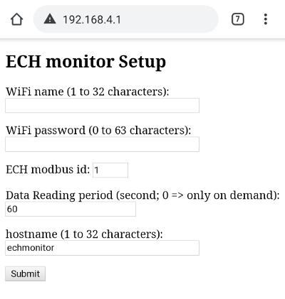

# ECH210B_WebAccess
WebInterface to read ECH210B PAC controler

# Installation
You will have to update config.h file to setup Serial pin and Force setup pin.
by default 
  * MODBUS RX_PIN is 13 and TX_PIN is 14
  * The force settings pin is 12.

# Setup
To entrer setup mode, Setup pin should be set to GND and then restart the module.
If no setup as been perform, no need use Setup Pin, module will switch automaticaly to setup mode

In setup mode, module is configured as Access Point.

Using your mobile phone, connect to the AP called **"echmonitor"**, password is **"password"**
then connect to 192.168.4.1 and you will get a setup page.

You can setup:
* your WiFi SSID
* your WiFi password
* the Modbus id of your ECH210B module
* the pulling period of data reading
* the hostname of the module once connected to your WiFi

# Usage
## web ui
This page present in an accordion a set of ECH210B register grouped by themes

## web api

- Direct access to ECH210b register
Request
Http GET http://<Module IP>/register?addr=<register number>

> http://192.168.1.19/register?addr=1135
>
> GET /register?addr=1135 HTTP/1.1
>
> Host: 192.168.1.19
>
> cache-controle: no-cache

Response

> Content-Type: text/plain
>
> 240 (register value as text string) 

- Access to ECH210b registers

Request
Http GET http://<Module IP>/register

> http://192.168.1.19/register
>
> GET /register HTTP/1.1
>
> Host: 192.168.1.19
>
> cache-controle: no-cache

Response

> Content-Type →application/json; charset=utf-8
>
>{
>
>    status": {
>
>        "CTN": "true",
>
>        "POWER": "false",
>
>        "STATE": "cool"
>
>    },
>
>    "inputs": {
>
>        "AI1": " 24.0",
>
>        "AI2": " 29.5",
>
>        "AI3": " -0.5",
>
>        "AI4": "  6.5",
>
>        "DI_COMPRESSOR": "ON",
>
>        "DI_BOILER": "ON",
>
>        "DI_PUMP": "ON",
>
>        "DI_WARMCOOL": "ON",
>
>        "DI_ONOFFSTANDBY": "OFF"
>
>    },
>
>    "outputs": {
>
>        "RL1": "OFF",
>
>        "RL2": "OFF",
>
>        "RL3": "OFF",
>
>        "RL4": "OFF",
>
>        "FanSpeed": "UNKNOWN"
>
>    },
>
>    "alarms": {
>
>        "auto": {
>
>            "HP": "OFF",
>
>            "BP": "OFF",
>
>            "PUMP": "OFF",
>
>            "COILER": "OFF",
>
>            "GAZ": "OFF",
>
>            "CONF": "OFF",
>
>            "SENSOR1": "OFF",
>
>            "SENSOR2": "OFF",
>
>            "SENSOR3": "OFF",
>
>            "SENSOR4": "OFF",
>
>            "MAXT": "OFF"
>
>        },
>
>        "manu": {
>
>            "HP": "UNKNOWN",
>
>            "BP": "UNKNOWN",
>
>            "PUMP": "UNKNOWN",
>
>            "COILER": "UNKNOWN",
>
>            "GAZ": "UNKNOWN",
>
>            "CONF": "UNKNOWN",
>
>            "SENSOR1": "UNKNOWN",
>
>            "SENSOR2": "UNKNOWN",
>
>            "SENSOR3": "UNKNOWN",
>
>            "SENSOR4": "UNKNOWN",
>
>            "MAXT": "UNKNOWN"
>
>        }
>
>    }
>
>}
> 
